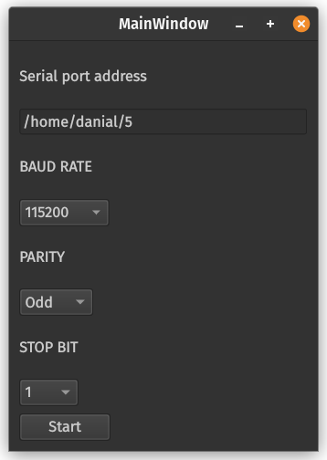
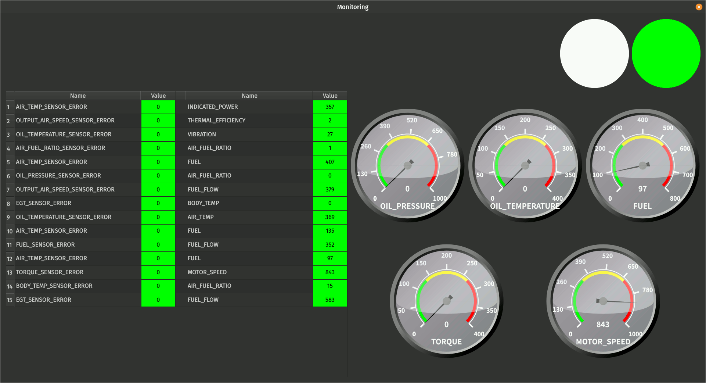

# Aircraft Engine Monitoring

## Project Description

This project is designed for monitoring aircraft engines. The core implementation is primarily in C++ with some components written in Python and QMake.

## Features

- **Real-time Engine Monitoring**: Continuously monitors engine parameters.
- **Data Analysis**: Analyzes collected data to detect anomalies.
- **Alert System**: Notifies in case of any critical engine conditions.
- **Historical Data Storage**: Stores historical data for future analysis.
- **User-friendly Interface**: Intuitive UI for easy interaction and monitoring.
- **Customizable Alerts**: Allows users to set custom alert thresholds.
- **Remote Monitoring**: Supports monitoring from remote locations.
- **Report Generation**: Generates detailed reports on engine performance and anomalies.

## Installation Guide

### Windows Installation

1. Download the Windows executable:
    - Visit the [releases page](https://github.com/danialmd81/aircraft_engine_monitoring/releases)
    - Download `aircraft_engine_monitoring_setup.exe`
    - Or use PowerShell:

      ```powershell
      Invoke-WebRequest -Uri "https://github.com/danialmd81/aircraft_engine_monitoring/releases/latest/download/aircraft_engine_monitoring_setup.exe" -OutFile "aircraft_engine_monitoring_setup.exe"
      ```

2. Run the installer:
    - Double-click the downloaded `.exe` file
    - Follow the installation wizard prompts
    - Accept the default installation location or choose your preferred path

### Linux Installation

1. Download the Linux installer:
    - Visit the [releases page](https://github.com/danialmd81/aircraft_engine_monitoring/releases)
    - Download `aircraft_engine_monitoring_setup.run`
`
    - Or use wget:

      ```bash
      wget https://github.com/danialmd81/aircraft_engine_monitoring/releases/latest/download/aircraft_engine_monitoring_setup.run

      ```

    - Install dependencies:

      ```bash
      sudo apt-get update
      sudo apt-get install libgl1-mesa-dev
      sudo apt-get install libxkbcommon-dev 
      ```

1. Make the installer executable and run:

    ```bash
    chmod +x aircraft_engine_monitoring_x64bit.run
    ./aircraft_engine_monitoring_x64bit.run
    ```

2. Follow the installation wizard prompts.

## Notes

- Ensure all dependencies are correctly installed and configured.
- For any issues during installation, refer to the project's documentation or seek help from the community.

## Demo




## Test Serial Ports

### Create Virtual Serial Ports

1. Install socat:

    ```sh
    sudo apt-get install socat
    ```

2. Create permanent rules by adding to `/etc/udev/rules.d/99-serial.rules`:

    ```sh
    KERNEL=="ttySOCAT*", SYMLINK+="/home/danial/4"
    KERNEL=="ttySOCAT*", SYMLINK+="/home/danial/5"
    ```

3. Start the virtual ports:

    ```sh
    socat -d -d pty,raw,echo=0,link=/home/danial/4 pty,raw,echo=0,link=/home/danial/5
    ```

### Remove Virtual Ports

1. Remove udev rules:

    ```sh
    sudo rm /etc/udev/rules.d/99-serial.rules
    ```

2. Reload udev rules:

    ```sh
    sudo udevadm control --reload-rules
    sudo udevadm trigger
    ```

3. Kill socat process:

    ```sh
    pkill socat
    ```
